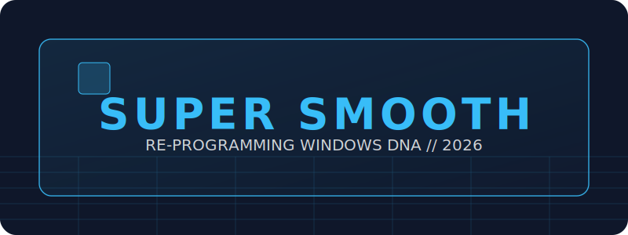

<!-- 2026 BULLETPROOF HERO: CUSTOM SVG -->

 

<!-- KINETIC ENGINE TYPING -->

  

<!-- 3D GLASS INTRO -->
<table border="0" width="100%" style="border-collapse: collapse;">
  <tr>
    <td width="60%" valign="middle">
      

        
Out-of-the-box Windows is trying to run a marathon while carrying a backpack full of bricks. 🎒

        
<b>Windows Super Smooth</b> is the surgical tool that removes them. We don't just "clean" things; we re-program the OS DNA so it finally acts like the high-performance engine you paid for. 🏎️

      

    </td>
    <td width="40%" align="center" valign="middle">
      
    </td>
  </tr>
</table>

 

<!-- PROTOCOL ADVISORY: HIGH CONTRAST -->

  

    <b>Don't break your toys. 🧸</b> 
    We’re messing with the engine room here (the Kernel). While we’ve tuned this to be as safe as possible, every machine is a snowflake. <b>Use this at your own risk.</b>   
    <b>Elite Tip:</b> Create a <b>System Restore Point</b> before ignition.
  

 

<!-- OPTIMIZATION STRIPE: CUSTOM GLASS SVG -->

<table border="0" cellpadding="10" cellspacing="0" width="100%">
  <tr>
    <td colspan="2" width="50%" valign="top">
      

        <h3>1. The Setup (DNA Swap)</h3>
        
Run <code>1_Advanced_OneTime_Setup.bat</code> to pin the Kernel to RAM and enable the Snappy Scheduler.

        
      

    </td>
    <td colspan="2" width="50%" valign="top">
      

        <h3>2. The Flush (Hygiene)</h3>
        
Run <code>2_Periodic_Flush.bat</code> when things feel "sticky" to purge junk and refresh the Shell.

        
      

    </td>
  </tr>
  <tr>
    <td width="25%" align="center">
      <b>🧠 KERNEL PIN</b> Zero disk-swap latency.
    </td>
    <td width="25%" align="center">
      <b>⚡ CPU PRIORITY</b> Active window dominance.
    </td>
    <td width="25%" align="center">
      <b>🧹 CACHE PURGE</b> Dump the pack-rat data.
    </td>
    <td width="25%" align="center">
      <b>🔌 DNS JOLT</b> No more dropped connections.
    </td>
  </tr>
</table>

 

<!-- IGNITION STRIPE: CUSTOM GLASS SVG -->

  

    
      <b>1. DOWNLOAD</b> ➔ <b>2. UNZIP</b> ➔ <b>3. RUN AS ADMIN</b> ➔ <b>4. RESTART</b>
    
  

  

  
    
  <b>Current Status:</b> <i>Windows DNA re-programmed. Friction Deleted. Performance Peak.</i> 🚀

